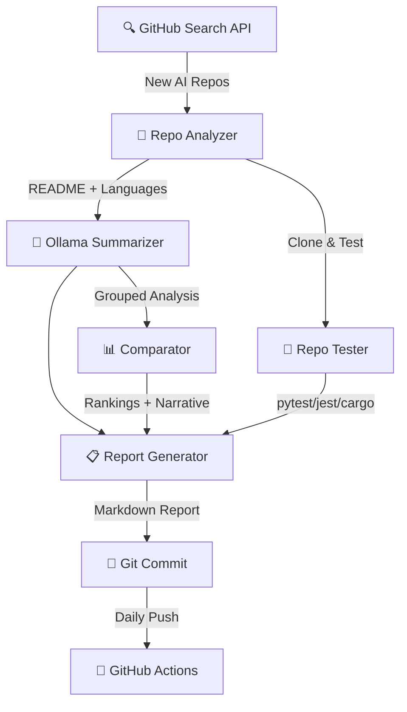

<div align="center">

# 🔬 AI Research Agent

[](https://github.com/USER/ai-research-agent/actions/workflows/daily-research.yml)


**Automated AI research agent that discovers, analyzes, clones, tests, and compares new GitHub repositories daily using local LLM summarization.**

</div>

---

## Architecture



## Features

| Feature | Description |
|---------|------------|
| **GitHub Search** | Finds repos created in last 24h matching AI/ML queries |
| **Deep Analysis** | Fetches README, language breakdown, dependency detection |
| **LLM Summaries** | Local Ollama generates structured analysis (what/innovations/impact) |
| **Clone & Test** | Clones repos, detects test frameworks, runs tests with timeout |
| **Comparative** | Scores repos, groups by language, LLM-written comparative narrative |
| **Daily Automation** | GitHub Actions installs Ollama in CI, runs full pipeline |

## Latest Report Preview

Reports are saved to \`reports/YYYY-MM-DD.md\` with per-repo analysis, test results, rankings, and comparative narratives.

## Setup

```bash
pip install -r requirements.txt
pip install -r dev-requirements.txt  # For linting
ollama pull llama3.2:3b
python main.py --no-commit
```

## CLI Options

| Flag | Description |
|------|------------|
| \`--no-commit\` | Skip git commit |
| \`--no-clone\` | Skip cloning and testing repos |
| \`--no-compare\` | Skip comparative analysis |
| \`--config PATH\` | Custom config file |

## Configuration

Edit \`config/settings.yaml\` — search queries, Ollama model, max repos, test timeouts.

## Development

```bash
ruff check src/ main.py --select=E,F --ignore=E501
mypy main.py --ignore-missing-imports
```
